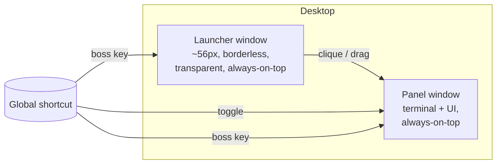
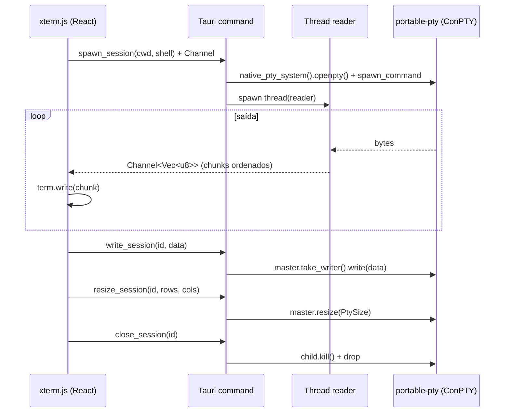

# Arquitetura — Specter

> Terminal flutuante stealth + launcher de Claude Code. Desktop Windows, `.exe` per-user (sem admin), invisível em compartilhamento de tela. Local-first, zero-backend.

Versões validadas pelo researcher em **jun/2026** (npm registry + crates.io). Ver [[US.md]] para os requisitos rastreados.

---

## 1. Stack e justificativa

### 1.1 Versões fixadas

| Camada | Pacote | Versão | Por quê |
|--------|--------|--------|---------|
| Shell desktop | `@tauri-apps/cli` | `2.11.3` | `.exe` pequeno, per-user sem admin, multi-janela, APIs nativas via Rust |
| | `@tauri-apps/api` | `2.11.1` | bindings JS do core |
| | crate `tauri` | `2.11.3` | runtime Rust |
| Atalho global | `@tauri-apps/plugin-global-shortcut` / crate | `2.3.2` | toggle/boss-key global (US-13, US-14) |
| Seletor pasta | `@tauri-apps/plugin-dialog` / crate | `2.7.1` | escolher cwd (US-02) |
| Notificação | `@tauri-apps/plugin-notification` / crate | `2.x` (fixar no scaffold) | toast nativo de comando longo (US-22) |
| FS (dispensável) | `@tauri-apps/plugin-fs` / crate | `2.5.1` | não usado por padrão; export (US-20) usa dialog `save` + escrita via comando Rust |
| Terminal | `@xterm/xterm` | `6.0.0` | render do terminal (escopo novo; `xterm` antigo deprecado) |
| | `@xterm/addon-fit` | `0.11.0` | ajuste de tamanho ao container |
| | `@xterm/addon-web-links` | `0.12.0` | links clicáveis no output |
| | `@xterm/addon-search` | `0.16.0` | busca no buffer (US-21) |
| PTY (Rust) | `portable-pty` | `0.9.0` | ConPTY default no Windows (US-01) |
| Win32 (Rust) | `windows` | `0.62.2` | `SetWindowDisplayAffinity` (US-04), `hwnd()` |
| | serde / serde_json | `1.x` | persistência JSON |
| Front | `react` / `react-dom` | `19.2.7` | UI |
| | `vite` | `7.3.5` | versão do `create-tauri-app` (Vite 8.0.16 existe; migrar é follow-up) |
| | `vitest` + `@testing-library/react` | `3.2.6` / `16.3.2` | unit/componente no front (jsdom 26) |
| | `@vitejs/plugin-react` | `4.7.0` | versão que o `create-tauri-app` pareia com Vite 7 (resolvida no scaffold da FASE 2.0) |
| | `tailwindcss` + `@tailwindcss/vite` | `4.3.1` | v4: sem config obrigatória, plugin no Vite, `@import "tailwindcss";` |
| | `typescript` | `5.8.3` | **strict, zero `any`**; TS 6 existe, mantido o 5.8 do template (migração = follow-up) |
| Testes | `vitest` + `@testing-library/react` | latest | unit/componente no front |
| | `cargo test` (built-in) | — | unit no Rust |

> **Decisão Vite (verificada no scaffold):** `create-tauri-app` pareia **Vite 7.3.5 + @vitejs/plugin-react 4.7.0** — combinação testada pelo time Tauri, adotada para garantir build verde. React 19.2.7, Tailwind 4.3.1 e Vitest 3.2.6 resolvidos sem conflito no `pnpm install`. Migrar para Vite 8 + plugin-react 6 + TS 6 fica como follow-up.

### 1.2 Princípios
- **Local-first / zero-backend.** Nenhum servidor; tudo na máquina.
- **Per-user, sem admin.** Escrita só em `%LOCALAPPDATA%`/`%APPDATA%`.
- **Zero `any`**, TS strict; **arquivos ≤ 400 linhas**; **component-per-folder** no front; módulos por responsabilidade no Rust.
- **Identidade visual:** dark + glassmorphism, accent `#FF5555`, marca "MChiodi" em splash/about.

---

## 2. Modelo de janelas (launcher + panel)

Duas janelas Tauri, ambas com exclusão de captura aplicada na criação.



- **Launcher window** — `WebviewWindowBuilder` com `decorations:false`, `transparent:true`, `always_on_top:true`, `skip_taskbar:true`, tamanho ~56px. Arrastável (drag region no front ou `start_dragging`). Posição persistida.
- **Panel window** — janela principal (terminal + UI), `always_on_top` (toggle em US-15), opacidade ajustável (US-16). Mostra/oculta via clique do launcher ou atalho global.
- **Toggle/boss-key** — `tauri-plugin-global-shortcut` registra o atalho de toggle (US-13) e a boss key (US-14); a boss key oculta ambas as janelas instantaneamente (`hide()`), preservando estado.
- **Stealth na criação** — após cada janela existir, o backend chama `capture::exclude_from_capture(hwnd)` (ver §4). Reaplicar se o handle mudar.

---

## 3. Terminal / PTY (ConPTY + portable-pty)

### 3.1 Fluxo de dados



### 3.2 Decisões
- **Backend ConPTY** via `native_pty_system()` (default no Windows). Sem emulação por pipe.
- **Uma PTY por sessão/aba/painel** (US-10, US-23). `SessionId` mapeia para `{master, child, writer, reader_thread}` guardado em estado Tauri (`Mutex<HashMap<…>>`).
- **Streaming por `Channel<Vec<u8>>`** (não `emit` global): ordering garantida por sessão, menor overhead. O `reader` roda em `std::thread` dedicada.
- **Resize** disparado pelo `fit-addon` → `resize_session` → `master.resize()`.
- **Kill limpo** ao fechar aba/painel: encerra `child` (árvore) e finaliza a thread reader — sem processos órfãos (US-27).
- **React 19 / StrictMode**: instância do xterm guardada em `useRef`; `term.dispose()` no cleanup para evitar double-mount em dev.

---

## 4. Stealth / exclusão de captura

- **API correta:** `SetWindowDisplayAffinity(hwnd, WDA_EXCLUDEFROMCAPTURE)` da `windows` crate. **Não** usar `set_content_protected()` do Tauri — ele aplica `WDA_MONITOR`, que não esconde de screen share.
- **Constantes:** `WDA_EXCLUDEFROMCAPTURE = 0x11` (esconde de captura) vs `WDA_MONITOR = 0x01` (o que `set_content_protected` aplica — só bloqueia duplicação de monitor, **insuficiente** para screen share).
- **HWND:** `webview_window.hwnd()` (sob `#[cfg(windows)]`) retorna o `HWND` da crate `windows` direto — sem conversão.
- **Cargo features:** `windows = { version = "0.62", features = ["Win32_Foundation", "Win32_UI_WindowsAndMessaging"] }`.
- **Requisito de SO:** Windows 10 **build 19041+** (2004). Abaixo disso a API não exclui da captura.
- **Fallback gracioso:** detectar a versão do SO / checar o retorno; se indisponível, **avisar o usuário claramente** (banner) e seguir — nunca falhar em silêncio (US-04 CA).
- **Escopo:** aplicado a launcher **e** panel, na criação e ao recriar handle.
- **Aviso honesto:** a MS afirma que isto não é garantia de segurança — documentar no about/onboarding.
- Código Win32 isolado em `src-tauri/capture/` atrás de `#[cfg(windows)]`; em outros SO, no-op + flag "não suportado".

### 4.5 Detecção de dependências (Node, npm/pnpm, git, claude, VS Code)
- Detecção **não-bloqueante** (US-18, US-26): rodar `--version` de cada ferramenta via `std::process::Command` (sem PTY), em paralelo, com timeout curto.
- Resultado cacheado e atualizável sob demanda. Ausência → estado vazio didático; **nunca** instalar nada com privilégio.
- Quick actions (US-26) habilitam/desabilitam conforme presença (ex.: VS Code → `code <path>`).

---

## 5. No-admin / empacotamento

- **Instalador NSIS `installMode: "currentUser"`** (default) em `tauri.conf.json > bundle > windows > nsis`:
  - **Sem UAC/elevação**, instala em `%LOCALAPPDATA%`, registro em **HKCU** (nunca HKLM), sem PATH global.
  - `perMachine`/`both` exigem admin → **proibidos**.
- **Versão portátil:** o Tauri 2 **não tem alvo "portátil" nativo**. Solução: distribuir `target/release/specter.exe` (build sem bundle) — roda standalone.
  - **Dependência:** WebView2 runtime (já presente em Win10+/Win11). Documentar; se ausente em máquina muito antiga, orientar (sem instalar com privilégio).
- **Sem serviços, sem tarefas agendadas, sem drivers.** Tudo user-space.

---

## 6. Estrutura de pastas

```
Specter/
├─ docs/                       # US.md, ARQUITETURA.md, notas de fase
├─ src/                        # frontend (component-per-folder)
│  ├─ main.tsx · App.tsx
│  ├─ components/
│  │  ├─ Terminal/            # xterm wrapper (US-01,21)  Terminal.tsx · useXterm.ts · Terminal.test.tsx · index.ts
│  │  ├─ Launcher/            # botão flutuante (US-03)
│  │  ├─ Panel/               # shell da UI (US-07)
│  │  ├─ Tabs/                # abas (US-10)
│  │  ├─ SplitView/           # split (US-23)
│  │  ├─ FolderPicker/        # cwd + recentes/favoritos (US-02,11)
│  │  ├─ CommandPalette/      # pré-comandos + snippets (US-06,09)
│  │  ├─ History/             # histórico (US-08,24)
│  │  ├─ Profiles/            # perfis + .env (US-12,19)
│  │  ├─ EnvStatus/           # status ambiente (US-18)
│  │  ├─ ProcessManager/      # processos (US-27)
│  │  ├─ CheatSheet/          # cheat sheet (US-25)
│  │  ├─ QuickActions/        # explorer/vscode/copy (US-26)
│  │  ├─ Settings/            # tema, opacidade, on-top, atalhos (US-15,16,17)
│  │  └─ Onboarding/          # tour + about/MChiodi (US-07)
│  ├─ hooks/                  # useSessions, useShortcuts, useTheme…
│  ├─ ipc/                    # wrappers tipados dos commands Tauri (zero any)
│  ├─ store/                  # estado UI + bridge de persistência
│  ├─ types/                  # tipos compartilhados
│  └─ styles/                 # tailwind + tema glassmorphism
├─ src-tauri/
│  ├─ src/
│  │  ├─ main.rs · lib.rs
│  │  ├─ pty/                 # openpty, spawn, stream, resize, kill (US-01,10,23,27)
│  │  ├─ windows/             # builders launcher/panel, always-on-top (US-03,15)
│  │  ├─ capture/            # SetWindowDisplayAffinity + fallback (US-04)
│  │  ├─ commands/            # commands Tauri expostos ao front
│  │  ├─ persistence/         # leitura/escrita JSON em app_local_data_dir (US-05..12)
│  │  ├─ env_detect/          # versões de Node/git/claude/VS Code (US-18,26)
│  │  └─ shortcuts/           # registro global-shortcut (US-13,14)
│  ├─ Cargo.toml · tauri.conf.json
│  └─ icons/
├─ package.json · vite.config.ts · tsconfig.json · tailwind via plugin
└─ README.md                  # atualizado ao fim de cada fase
```

**Regra:** todo arquivo ≤ 400 linhas; estourou, refatora em submódulos.

---

## 7. Persistência

- **Local:** `app_local_data_dir()` → `%LOCALAPPDATA%/com.mchiodi.specter/`. Preferido sobre roaming para perfil stealth/portátil. **Roaming (`%APPDATA%`) descartado de propósito** — a config não deve seguir o usuário entre máquinas corporativas.
- **Formato:** JSON via `serde`/`serde_json` (sem `tauri-plugin-store` salvo necessidade de múltiplos writers).
- **Fallback:** se a pasta não for gravável → `%TEMP%` / modo portátil + aviso (US-05 CA).

| Arquivo | Conteúdo | US |
|---------|----------|----|
| `settings.json` | tema, accent, opacidade, always-on-top, atalhos, shell padrão, posição do launcher | US-07,13,14,15,16,17 |
| `commands.json` | paleta de pré-comandos (categorias) | US-06 |
| `snippets.json` | snippets/favoritos com placeholders | US-09 |
| `history.json` | histórico (cmd, cwd, ts, duração) com limite | US-08,24,29 |
| `profiles.json` | perfis (nome, path, init[], ref de `.env`) | US-12,19 |
| `dirs.json` | recentes (auto) + favoritos (fixados) | US-02,11 |

- **Segurança:** valores de `.env` mascarados na UI e **nunca** logados (US-19). `.env` referenciado por caminho, conteúdo não commitado/exposto.

---

## 8. Riscos e mitigações

| Risco | Impacto | Mitigação |
|-------|---------|-----------|
| Antivírus/EDR sinaliza `.exe` não assinado | Bloqueio em PC corporativo | Build reproduzível + orientação ao usuário; assinatura de código fica como follow-up |
| `WDA_EXCLUDEFROMCAPTURE` indisponível (Win < 19041) | Stealth não funciona | Detectar versão + retorno; banner claro, sem falha silenciosa (US-04) |
| Pasta de config sem permissão de escrita | Não persiste | Cair para `%TEMP%`/portátil + aviso (US-05) |
| Claude/Node ausentes | App "vazio" | Estado vazio didático; detecção não-bloqueante; nunca instalar com privilégio (US-18) |
| WebView2 ausente (máquina antiga) | App não abre | Documentar; orientar instalação user-level |
| Processos órfãos ao fechar aba | Vazamento | Kill da árvore do `child` + join da thread reader (US-10,27) |
| xterm double-mount (React 19 StrictMode) | Terminal duplicado em dev | Instância em `useRef` + `dispose()` no cleanup |
| Vite 8 bleeding-edge x template | Atrito no scaffold | Pinar Vite 7 do `create-tauri-app`; Vite 8 é follow-up |
| `set_content_protected` (WDA_MONITOR) confundido com stealth | Captura ainda visível | Usar Win32 `SetWindowDisplayAffinity` direto (§4) |

---

## 9. Rastreabilidade US → módulo

| US | Título | Front | Rust |
|----|--------|-------|------|
| US-01 | Terminal + Claude Code | `components/Terminal` | `pty/`, `commands/` |
| US-02 | Local de abertura | `components/FolderPicker` | `plugin-dialog`, `persistence/` |
| US-03 | Botão flutuante | `components/Launcher` | `windows/` |
| US-04 | Invisível em screen share | banner em `Panel` | `capture/` |
| US-05 | `.exe` sem admin | — | `tauri.conf.json` (nsis currentUser) + build portátil |
| US-06 | Pré-comandos | `components/CommandPalette` | `persistence/` |
| US-07 | UI didática on-top | `Panel`, `Onboarding` | `windows/` |
| US-08 | Histórico | `components/History` | `persistence/` |
| US-09 | Snippets | `components/CommandPalette` | `persistence/` |
| US-10 | Abas/sessões | `components/Tabs` | `pty/` |
| US-11 | Dirs favoritos/recentes | `components/FolderPicker` | `persistence/` |
| US-12 | Perfis de projeto | `components/Profiles` | `persistence/`, `pty/` |
| US-13 | Atalho global | `hooks/useShortcuts` | `shortcuts/` |
| US-14 | Boss key / pânico | `hooks/useShortcuts` | `shortcuts/`, `windows/` |
| US-15 | Always-on-top toggle | `components/Settings` | `windows/` |
| US-16 | Opacidade | `components/Settings` | `windows/` |
| US-17 | Temas | `components/Settings`, `styles/` | — |
| US-18 | Status do ambiente | `components/EnvStatus` | `env_detect/` |
| US-19 | Env vars / `.env` | `components/Profiles` | `persistence/`, `pty/` |
| US-20 | Exportar log | `components/Terminal` | `commands/` (escrita Rust) + `plugin-dialog` (save) |
| US-21 | Busca no output | `components/Terminal` (search addon) | — |
| US-22 | Notificação comando longo | `hooks/useSessions` | `plugin-notification` |
| US-23 | Split view | `components/SplitView` | `pty/` |
| US-24 | Autocomplete | `components/History` | — |
| US-25 | Cheat sheet | `components/CheatSheet` | — |
| US-26 | Quick actions | `components/QuickActions` | `env_detect/`, `commands/` |
| US-27 | Gerenciador de processos | `components/ProcessManager` | `pty/`, `commands/` |
| US-28 | Drag & drop | `components/Terminal` | — |
| US-29 | Cronômetro | `components/Terminal`, `History` | `pty/` |

> Cada feature entra no commit referenciando sua US (ex.: `feat(US-04): exclusão de captura`).
